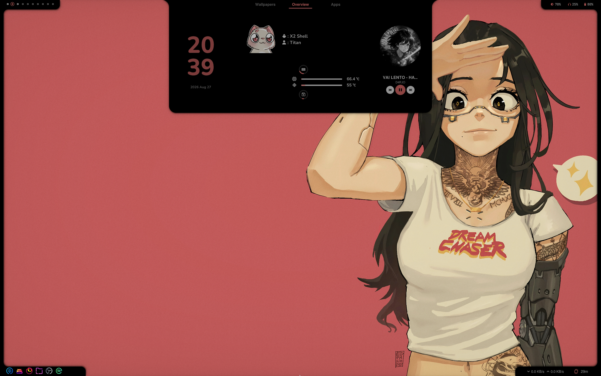

<div align="center">

# X2‑Shell

**A custom desktop shell built with [Quickshell](https://quickshell.org/) for wlroots‑based Wayland compositors**


</div>

---

##  Preview

<div align="center">

<!-- Main screenshot -->


<br><br>

<!-- Demo video: GitHub renders mp4 files that are uploaded through the README/issue editor drag-and-drop.
     If you paste the mp4 into the GitHub web editor when creating this file, GitHub will replace the
     line below with a working https://github.com/user-attachments/... link — keep that link if so.
     Otherwise this links straight to the file in the repo. -->
<a href="assets/demo.mp4">▶ Watch the full demo </a>

---

##  Features

- **Custom layer‑shell bar** — rounded, borderless left/right bars rendered per‑monitor via `Quickshell.screens`
- **App launcher** — keyboard‑driven, fuzzy search with focus/selection state
- **Overview** — quick desktop/workspace overview panel
- **Taskbar** — live list of running windows
- **Power menu** — shutdown / reboot / logout / lock actions
- **Wallpaper switcher** — browses a wallpaper folder and applies your pick
- **Spotify / MPRIS widget** — now‑playing card that hooks into any MPRIS‑compatible player
- **System monitor service** — CPU, RAM, GPU usage & temps, storage usage, network up/down, uptime
- **Volume, battery & workspace indicators**
- **Brightness control**, including `x2-bright` — a small C daemon + systemd service for controlling
  brightness on **NVIDIA OLED panels via DPCD AUX**, for setups where the standard sysfs backlight
  interface doesn't work
- **Fully themeable** — every color driven from a single `Colors.qml` singleton
- **Reusable UI kit** — `LevelBar`, `LevelRing`, `Curves`, `Rou_Indicator`, popups, etc.

---

##  Requirements

| Dependency | Notes |
|---|---|
| A wlroots‑based Wayland compositor | e.g. Hyprland — X2‑Shell uses `WlrLayershell` |
| [Quickshell](https://quickshell.org/) | the shell runtime this config is built on |
| Qt6 (`qtdeclarative`, `qt5compat`) | QML modules, `Qt5Compat.GraphicalEffects` used by the wallpaper switcher |
| A [Nerd Font](https://www.nerdfonts.com/) | icon glyphs used throughout the bar/components |
| `Nunito` font | used for UI text |
| `gcc` + `make` | only if you build/install `x2-bright` |
| `brightnessctl` | fallback brightness control for non‑NVIDIA setups |

---

##  Installation

1. **Install Quickshell** for your distro — see the [Quickshell docs](https://quickshell.org/docs/) for instructions.

2. **Clone this repo** into your Quickshell config directory:

   ```bash
   git clone https://github.com/titan7k-zc/X2-Shell.git ~/.config/quickshell/X2-Shell
   ```

3. **Run it:**

   ```bash
   quickshell -c X2-Shell
   ```

4. *(Optional, NVIDIA OLED brightness only)* build and enable the `x2-bright` helper:

   ```bash
   cd ~/.config/quickshell/X2-Shell/others/x2-bright
   sudo pacman -S --needed gcc make   # or your distro's equivalent
   make
   sudo make install
   sudo systemctl daemon-reload
   sudo systemctl enable --now x2-bright.service
   ```

   See `others/x2-bright/help.txt` for manual control and uninstall steps.

---

##  Configuration

- **Colors / theme** → `config/Colors.qml` (single source of truth for every color used across the shell)
- **Wallpaper folder** → set `folderpath` in `modules/wall/WallpaperSwitcher.qml` to your own wallpaper directory
- **Icons** → components expect Nerd Font glyphs; set `iconFontFamily` on components that expose it if you use a different icon font
- **Entry point** → `shell.qml` wires up the modules — comment/uncomment modules there to enable or disable parts of the shell

---

##  Credits

Built on top of [Quickshell](https://quickshell.org/) by [outfoxxed](https://github.com/outfoxxed).

##  License

No license has been added yet — all rights reserved by default until one is added.
Consider adding a `LICENSE` file (e.g. MIT) if you want others to reuse this config.
